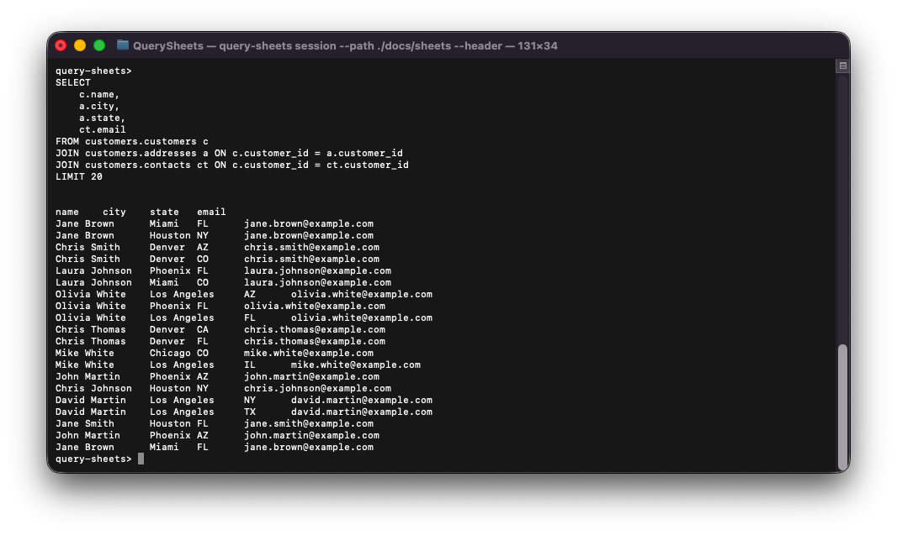
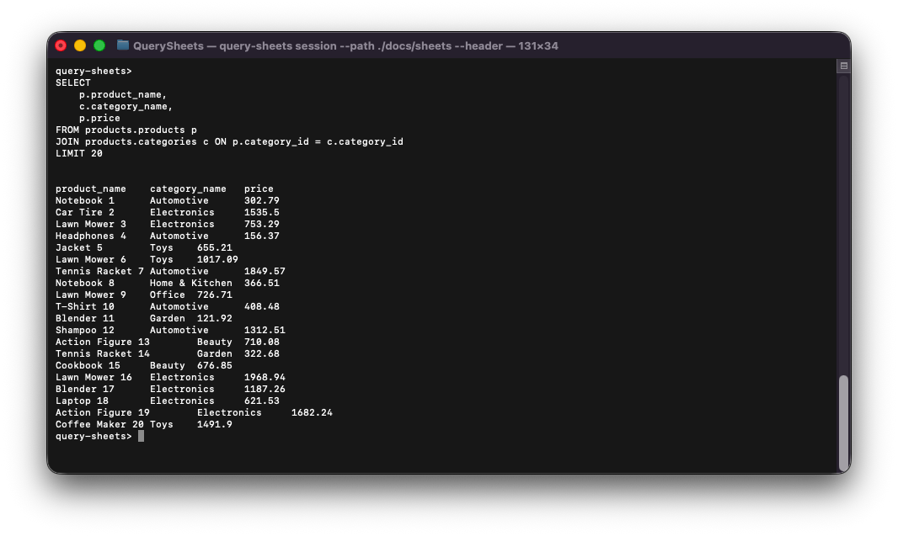
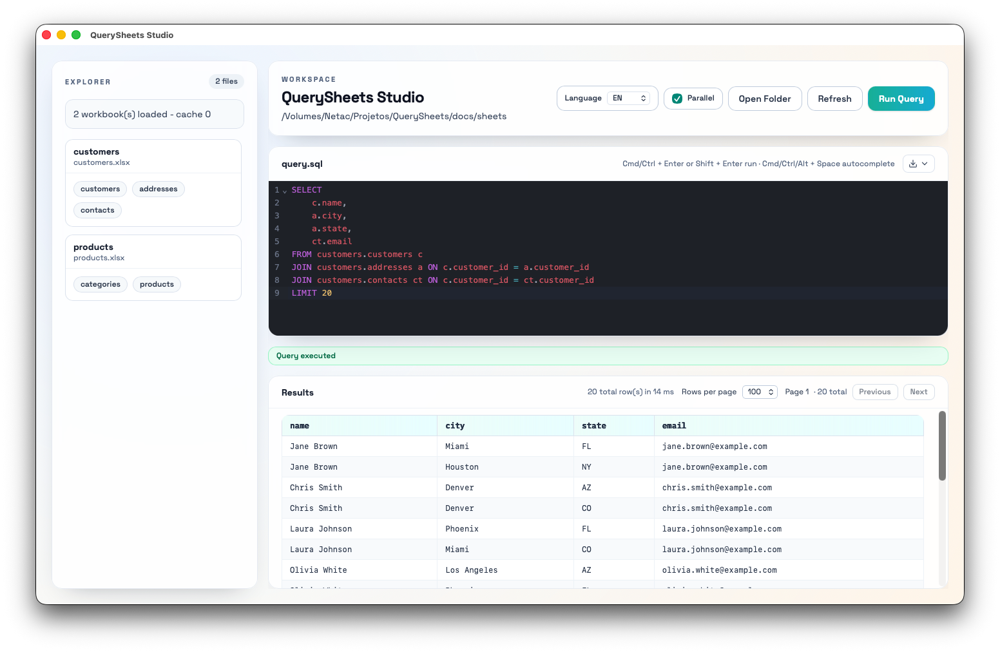
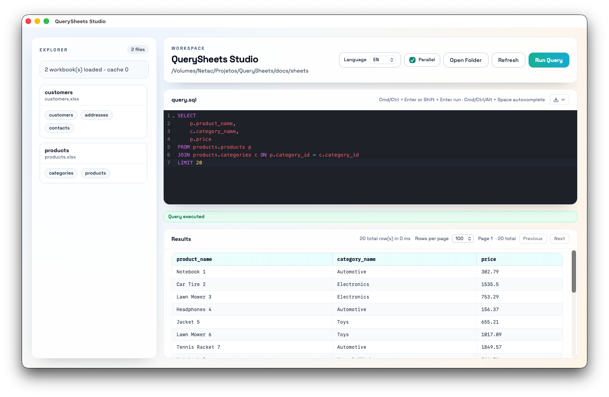

# QuerySheets


SQL query engine for spreadsheet files, built in Rust.

QuerySheets lets you query `.xlsx` files with SQL syntax from the CLI and from a desktop app (Tauri).

## Highlights

- Rust multi-crate architecture (`core`, `adapters`, `query`, `cli`)
- Excel adapter isolated via `calamine`
- SQL support with filtering, joins, aggregation, ordering, and pagination
- Interactive session mode for repeated queries over files/folders
- Export to CSV, JSON, and JSONL
- Optional desktop app: QuerySheets Studio

## Application Preview

### CLI example: customers query



### CLI example: products query



### Desktop app example: customers query



### Desktop app example: products query



## Current Functionality

### Query engine

- `SELECT`, wildcard (`*`), aliases (`AS`), and arithmetic expressions
- `CAST(expression AS type)` in projections and aggregate expressions
- `WHERE` with `=`, `!=`, `>`, `<`, `>=`, `<=`, `LIKE`, `NOT LIKE`, `AND`, `OR`
- `IN`, `NOT IN`, `EXISTS`, and scalar subquery flows used by tests
- `INNER JOIN`, `LEFT JOIN`, `RIGHT JOIN` with alias support
- `GROUP BY` with:
  - `COUNT(*)`
  - `COUNT(column)`
  - `SUM(column)`
  - `AVG(column)`
  - `STDDEV(column)`
  - `MIN(column)`
  - `MAX(column)`
- `ORDER BY` (`ASC`/`DESC`, `NULLS FIRST`/`NULLS LAST`, positional ordering)
- `LIMIT` and `OFFSET`
- Optional case-sensitive string comparison via `--case-sensitive-strings`

### CLI

- `query` command for one-shot execution
- `session` command for interactive querying
- Session supports file mode and folder mode (`FROM <file>.<worksheet>`)
- Header output via `--header`
- Export output via `--output` (`.csv`, `.json`, `.jsonl`)

### QuerySheets Studio (desktop)

- Open spreadsheet folders and inspect available workbooks/tables
- SQL editor experience with run controls
- Results table with pagination and refresh flows
- Uses the same Rust query engine as the CLI

## Example Queries

Customers query ([docs/queries/clients.sql](docs/queries/clients.sql)):

```sql
SELECT 
    c.name,
    a.city,
    a.state,
    ct.email
FROM clients.customers c
JOIN clients.addresses a ON c.customer_id = a.customer_id
JOIN clients.contacts ct ON c.customer_id = ct.customer_id
LIMIT 20
```

Products query ([docs/queries/products.sql](docs/queries/products.sql)):

```sql
SELECT 
    p.product_name,
    c.category_name,
    p.price
FROM products.products p
JOIN products.categories c ON p.category_id = c.category_id
LIMIT 20
```

## Installation

### Windows

1. Install Rust using rustup:

```powershell
winget install Rustlang.Rustup
```

2. Install Node.js LTS:

```powershell
winget install OpenJS.NodeJS.LTS
```

3. Install Microsoft Visual C++ Build Tools (required for Rust native builds):

```powershell
winget install Microsoft.VisualStudio.2022.BuildTools
```

4. Clone and install dependencies:

```powershell
git clone https://github.com/obraia/QuerySheets.git
cd QuerySheets
cd apps/query-sheets-studio
npm install
cd ../..
```

### macOS

> If you are installing from a GitHub Release artifact, check [Running Unsigned macOS Builds](#running-unsigned-macos-builds) for first-run Gatekeeper steps.

1. Install Rust:

```bash
curl --proto '=https' --tlsv1.2 -sSf https://sh.rustup.rs | sh
```

2. Install Node.js LTS (example with Homebrew):

```bash
brew install node
```

3. Clone and install dependencies:

```bash
git clone https://github.com/obraia/QuerySheets.git
cd QuerySheets/apps/query-sheets-studio
npm install
cd ../..
```

### Linux

1. Install build prerequisites (example for Debian/Ubuntu):

```bash
sudo apt update
sudo apt install -y build-essential pkg-config libssl-dev curl git
```

2. Install Rust:

```bash
curl --proto '=https' --tlsv1.2 -sSf https://sh.rustup.rs | sh
```

3. Install Node.js LTS:

```bash
sudo apt install -y nodejs npm
```

4. Clone and install dependencies:

```bash
git clone https://github.com/obraia/QuerySheets.git
cd QuerySheets/apps/query-sheets-studio
npm install
cd ../..
```

## Build and Run

From repository root:

```bash
cargo check
cargo build
```

CLI help:

```bash
cargo run -p query-sheets-cli -- --help
```

Run a one-shot query:

```bash
cargo run -p query-sheets-cli -- query \
   --file ./docs/sheets/customers.xlsx \
  --sql "SELECT name FROM customers" \
  --header
```

Session mode:

```bash
cargo run -p query-sheets-cli -- session --path ./docs/sheets --header
```

Desktop app (Tauri):

```bash
cd apps/query-sheets-studio
npm install
npm run tauri:dev
```

Desktop app build:

```bash
cd apps/query-sheets-studio
npm run tauri:build
```

### Running Unsigned macOS Builds

If you downloaded the `.dmg` from Releases and macOS shows a warning like "app is damaged" or blocks opening, it is usually Gatekeeper quarantine on a non-notarized build.

1. Remove quarantine from the downloaded `.dmg`:

```bash
xattr -dr com.apple.quarantine ~/Downloads/QuerySheets*.dmg
```

2. Install the app to `/Applications`.

3. Remove quarantine from the installed app:

```bash
xattr -dr com.apple.quarantine "/Applications/QuerySheets Studio.app"
```

4. Open the app for the first time:

```bash
open "/Applications/QuerySheets Studio.app"
```

If needed, use Finder and choose **Right click -> Open** on first launch.

## Repository Layout

```text
/apps
  /query-sheets-studio
/crates
  /core
  /adapters
  /query
  /cli
/docs
  /images
  /queries
  /sheets
```

## References

- SQL parser foundation: https://github.com/apache/datafusion-sqlparser-rs
- Excel reader adapter: https://github.com/tafia/calamine

## License

See [LICENSE](LICENSE).
